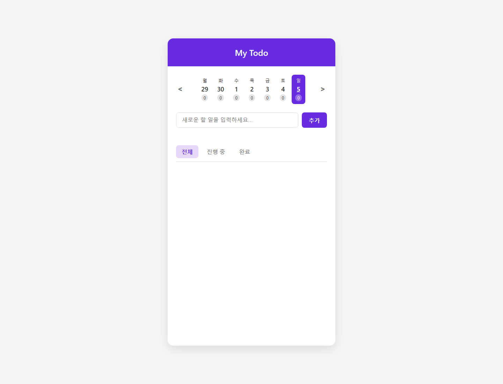
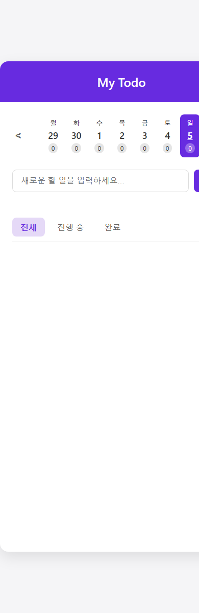

# Vanilla JS Todo App

Vanilla JS만으로 만든 깔끔하고 미니멀한 Todo 리스트 애플리케이션입니다.

## Screenshots

| Desktop | Mobile |
| --- | --- |
|  |  |

## 파일 구조
```markdown
todo-vanilla/
├── index.html
├── style.css
├── app.js
└── README.md
```

## 목표 기능
- Todo CRUD (생성, 읽기, 수정, 삭제)
- 상태별 필터링 (전체 / 진행 중 / 완료)
- 일간 뷰 (날짜별 Todo 관리)
- 로컬스토리지를 활용한 데이터 유지

## 실행 방법
1. 로컬 환경에서 `index.html` 파일을 브라우저로 엽니다.
2. 혹은 VSCode의 `Live Server` 확장을 설치하여 `index.html`을 실행합니다.
